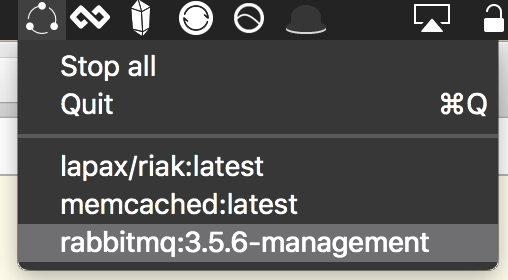

# Dockermenu

A small application for your mac os x menu bar that lists all running docker containers.
Made because I kept leaving a bunch of running stuff on my old macbook which made all
resources go poof. :fire:

Clicking an item in the menu will stop that particular container.

## Limitations

Dockermenu has only been tested on my local machine running Mac OS X El Capitan.

Tested with these docker versions:

    Docker version 1.12.0-rc2, build 906eacd, experimental
    docker-machine version 0.8.0-rc1, build fffa6c9

Dockermenu has been tested with "Docker for mac": https://docs.docker.com/docker-for-mac/

This is my very first Swift experiment, and it was conceived during two afternoons and with a lot of google. => lol code.

## Build and run

I have yet to publish this to the App store (or anywhere else really) - so you need to build this yourself. Here's how:

1. Open the project in Xcode
2. Click on the `Product` -> `Archive` menu item
3. Click "Export..."
4. Chose "Export as a Mac Application"

This should generate a `dockermnu.app` ready to be run.
